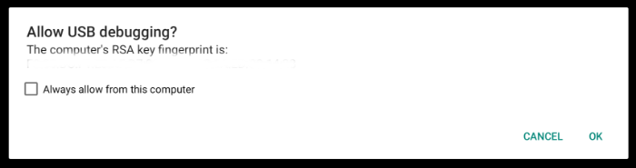
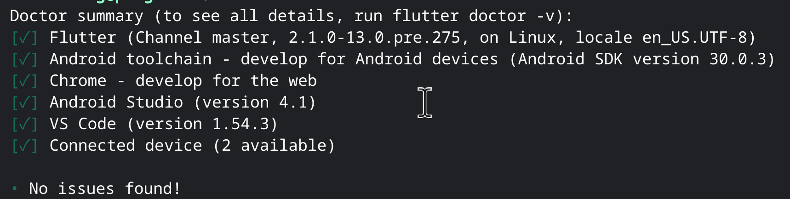

# Android Studio + Flutter + Dart + Connecting flutter to Chromebook

We found the following way is the easiest one to setup Android Studio together with flutter and dart.

# Install Flutter + Dart

1) Download a copy

> git clone https://github.com/flutter/flutter.git

2) Edit /etc/profile,

> sudo nano /etc/profile

3) Update path

[Read more at: https://flutter.dev/docs/get-started/install/chromeos#update-your-path]

Locate the following section, add your path and save the file:

> if [ "`id -u`" -eq 0 ]; then

>   PATH="..."

> else

>   PATH="/usr/local/bin:...:[PATH_TO_FLUTTER_GIT_DIRECTORY]/flutter/bin"

> fi

> export PATH

4) Make sure ADB debugging is enabled: Settings > Linux > Develop Android apps > Enable ADB debugging

5) Restart Linux virtual machine

6) Pre-download development binaries:

> flutter precache

7) Run on terminal:

> flutter doctor

8) Select "Always allow from this computer" to authorize connect flutter to your Chromebook upon prompting "Allow USB debugging?"

9) Run on terminal the following command and accept all licenses upon prompting:

> flutter doctor --android-licenses

10) At this point, you should be able to create a new flutter project in Android Studio and test your project with your chromebook directly. To have a final check, run:

> flutter doctor

It should looks like:

Please note that VS Code is optional.

# Install Android Studio

1) Go to https://developer.android.com/studio (with a Chrome OS browser, not with a Linux browser, so that it automatically directs to a download link for the Chrome os version of Android Studio.)

2) Download Chrome OS installation file for Chrome OS

3) Open "Files" app, go to "Downloads" folder and locate the downloaded file.  In our testing, the file name is "android-studio-ide-201.7199119-cros.deb".

4) Right click and select "Install with Linux"

5) Launch after installation is finished, via either launcher or running "/opt/android-studio/bin/studio.sh" on terminal

6) Follow the "Setup Wizard" to complete the setup.

7) On welcome screen, select "Configure > Plugins"

8) Search for "flutter" and install flutter plugin

9) Restart Android Studio after installing "flutter" plugin

# [Optional]

You may encounter the following warning:

dpkg: warning: parsing file '/var/lib/dpkg/status' near line 57 package 'android-studio':
 missing 'Maintainer' field

To get rid of this warning:

1) Run

> sudo nano /var/lib/dpkg/status

2) Use "ctrl + shift + -" key combination to go to line 57

3) Enter "Maintainer: "

3) Save the file (ctrl + o + enter) and exit (ctrl + x)

# Create an alias for use in terminal

> echo "alias studio=/opt/android-studio/bin/studio.sh & disown" >> ~/.bashrc

> studio

# Trouble-shooting: integrated terminal does not have flutter path

If you lanch Android Studio by click its icon on Launch, you may find flutter command now available.  You may need to set assign further variables.  A simple solution is to launch studio from terminal you can find flutter command works directly from Android Studio's integrated terminal.

You may read the section above on creating an alias:
https://github.com/eliranwong/ChromeOSLinux/blob/main/development/AndroidStudioFlutter.md#create-an-alias-for-use-in-terminal

